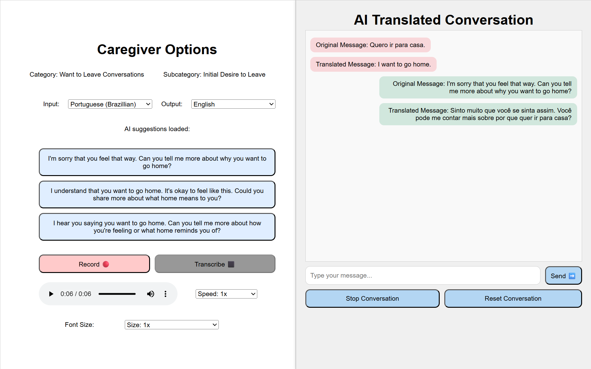

# BME470: Language Interpreter for Nurturing Care System (LINCS)
This GitHub repository is dedicated to hosting the source code for our BME470H1: Biomedical Systems Engineering Design Capstone Project, the Language Interpreter for Nurturing Care System (LINCS).

System User Interface:

Installation instructions (assuming Node.js is downloaded):
1. Clone the repository
2. Open the repository in Visual Studio Code
3. Run "npm install"
4. Run "npx vite" to run the application
(Optional)
5. Run "npx vite build" to build the application for production. The current configuration is intended to be built as a static web application.
6. Note that once you build the app, change the code in index.html that references the built JavaScript source code file to 
  

The build tool used was vite. The system is designed to be hosted as a static website. 

Please use your API keys for the Microsoft Azure services used by the application, including the:
Translation API
Quick Transcription API (speech services)
Text to Speech API (speech services)
AI Foundry API (deployed model in AI foundry, and the associated API key)

The codebase was partially generated by Microsoft Copilot AI. Code authoring attribution is indicated for both the main page (index.html), which is used for the user interface code, along with the main.js JavaScript file used as the application's backend. 

To search through the authoring in each section, search for the word "ATTRIBUTION" to see which sections were human-authored and (if applicable) specific contributor work contributions. 

Project Team Members: 
Ashni Balakrishnan, Bethelem Charles, Nicholas Sinclair, Ria Borger  

